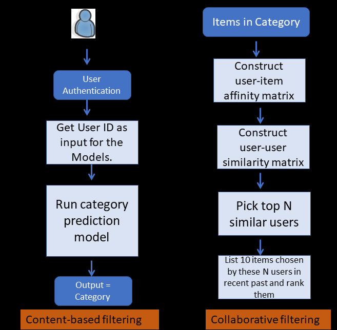

# hybrid_recommender

This project was completed as a part of York University Certificate course in Machine Learning by a team of two (including myself). We coded a recommender system for an online sales company (XYZ). Unfortunately I cannot upload the code/data. A brief summary of the approach used follows.

This particular company XYZ has a big user base. XYZ also has many vendors selling different products. The users get deals from XYZ on products sold by the vendors. The problem statement is *recommend products to each user which will be displayed on the respective user's homepage*. These recommendation should refresh everyday and tailored to the liking of each user. We developed a recommender system which solved this problem. This system used both
content-based and collaborative filtering. We divided the products into N categories. Each category contained several products which are called items.
We adopted an approach to predict the top three categories for each user and then the predict the top item in each category to be recommended to the user. We adopted a content based filtering to predict the top three categories for each user. Then we used collaborative filtering based on user similarity to predict the top item for each category. These three items are displayed on the homepage of the user. This algorithm is executed overnight and the three top items for each user are  displayed on their respective homepages the following day.

The cold start problem is addressed by considering the characteristics of the new user like age, gender, profession and location.

The content based prediction is based on a model trained for each user separately. It is possible to decrease the implemntation strategy by training a single model based on the data of all the users. A compromise between these two strategies is to train a model for a few segments of the users. The users can be divided into segments based on, for example, demographhics.
